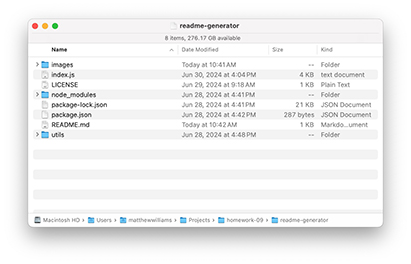
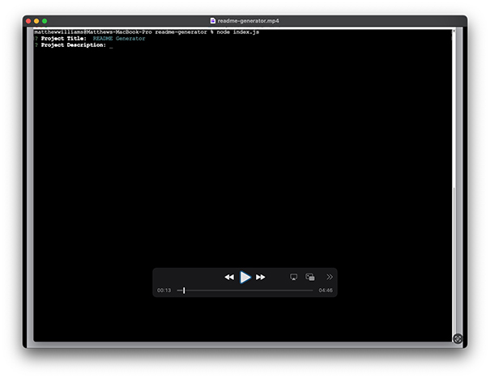

# README Generator

## License

MIT License

## Description
This app helps developers generate high-quality README files in Markdown format by prompting them for key information.

## Table of Contents
- [Installation](#installation)
- [Usage](#usage)
- [License](#license)
- [Contributing](#contributing)
- [Tests](#tests)
- [Questions](#questions)

## Installation
As a CLI, README Generator requires no installation, per se, but ensure that index.js and its associated files and folders are contained in the same folder as shown here. README Generator depends on the Inquire module available from NPM.

## Usage
To use README Generator, type "node index.js" in Terminal from the folder containing the index.js file. To see a video of the application in action, click on the screen capture below.

## Contributing
To contribute to README Generator, clone this repository locally and commit your code to a separate branch.

## Tests
If you are making core library changes, please write unit tests for your code and ensure that everything is working correctly before opening a pull request.

## Questions
You can see my github repositories at [MatthewWilliamsCMH](https://github.com/MatthewWilliamsCMH/).  
Drop me a line at [matthewwilliamscmh@icloud.com](mailto:matthewwilliamscmh@icloud.com).